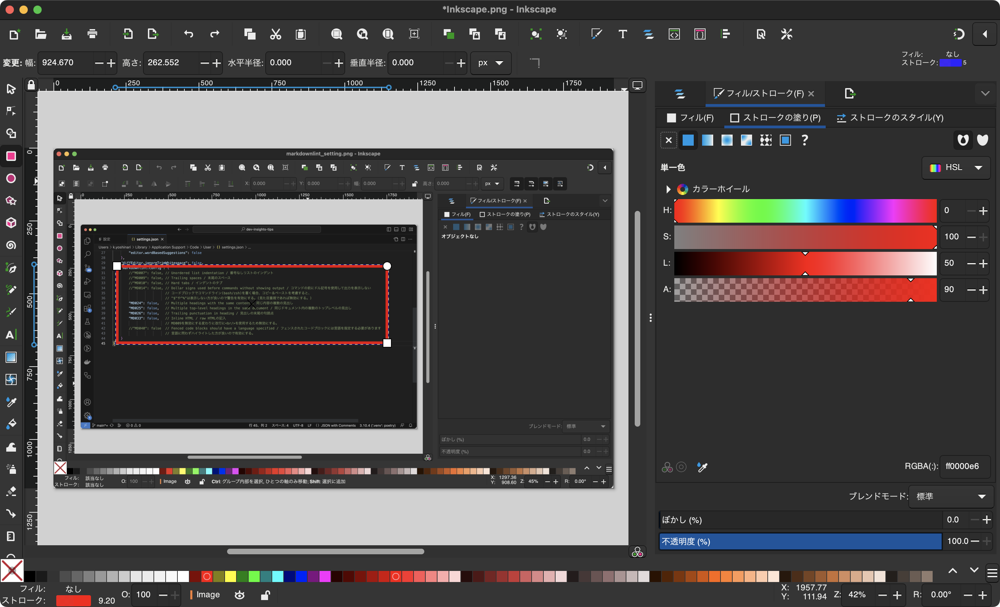
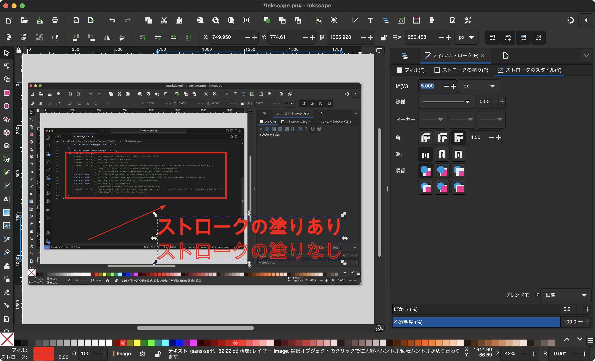

# Tools tips

Here are some tools that I personally use.

## Workflowy

Outliner tool<br />
Specialized in writing and no folders so you don't have to worry about managing it.

### Download Link

[https://workflowy.com/downloads/windows/](https://workflowy.com/downloads/windows/)

### Usage

DL the application or access it from a browser and write sentences under HOME.<br />
However, since all sentences will be aggregated in HOME, it will be vertically long, so you can manage tags by using tags (#,@). You can categorize them if necessary.

#### Design Changes

The default is a white background, which can be changed in the following Theme from the three-point leader vertical (︙) in the upper right corner of the screen.

```text
setting > Appearance > Theme > Dark
```

## Obsidian

A markdown editor application that can structure and decorate documents according to a "markdown" format.

### Download Link

[https://obsidian.md/download](https://obsidian.md/download)

### Usage

Files are stored in the vault you initially set up, but if you use Windows and iOS, you can set it to \[iCloud\]\[1\] so that you can share it with each OS.

Currently, if you do not choose iCloud as the storage location, you can only use the monthly cloud version.

\[1\]:For Windows, you need to download [iCloud for Windows](https://support.apple.com/ja-jp/HT204283).

#### Adding Plug-ins

Plug-ins are available at obsidian.<br />
You can search for and install plug-ins by changing the following settings

```bash
Settings > Third-party plugins > Community Plugins > Browse and search for PlantUML
```

For example, UML is not drawn by default, so PlantUML installation and activation will enable it.

## Inkscape

[Inkscape](https://inkscape.org/ja/)is an open source vector graphics editor.

The application is available free of charge, runs on a variety of platforms (Windows, macOS, Linux, etc.), and offers extensive vector graphics creation and editing capabilities. It includes general drawing tools, path editing tools, text tools, shape tools, and more, and is used in a wide variety of projects.

Inkscape supports vector formats such as SVG (Scalable Vector Graphics) and is compatible with other vector graphics software. Plug-ins and extensions are available to extend its functionality.

The export function allows users to create PNGs, SVGs, and PDFs, making it easy to use.

### Usage

#### basic functionality


##### Short Shaped Figure No Fill

1. select the short form on the left
1. edit the border (change color)
   Select Fill and choose No Fill
   (Can also be done with None on the fill in the lower left corner of the screen)
1. fill
   Change the color in the stroke fill



##### Arrow symbol

1. Select the pencil tool
1. draw a line from the start point to the end point
1. change arrow style/size in Stroke Style


##### Input text

1. select the Text tool
1. enter text
1. in Stroke Fill/Style


