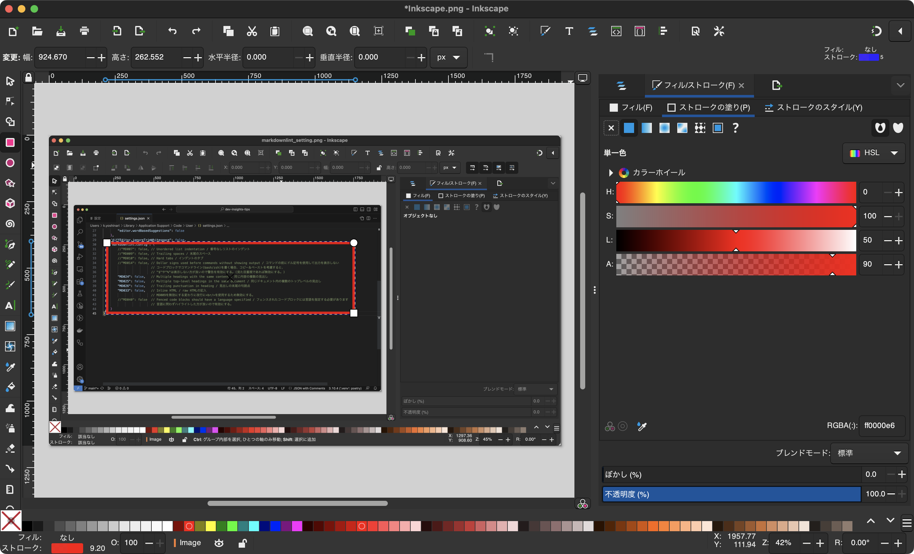
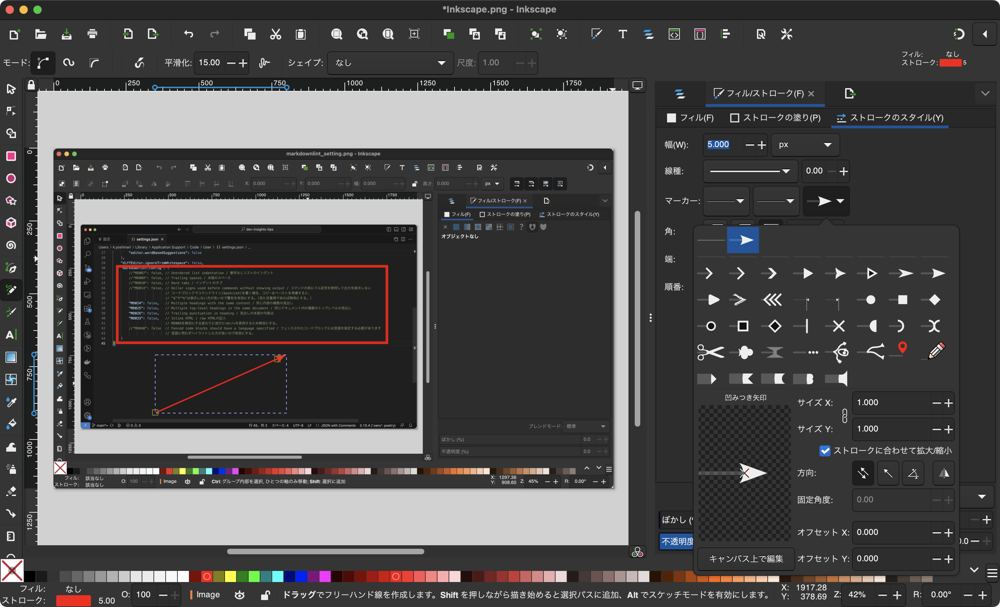

# Tools tips

個人で利用しているツールを紹介します。

## Workflowy

アウトライナーツール<br />
文章に特化していてフォルダもないので管理に悩まないのが特徴

### ダウンロードリンク

[https://workflowy.com/downloads/windows/](https://workflowy.com/downloads/windows/)

### 使い方

アプリをDLするか、ブラウザからアクセスしてHOME以下に文章を書いていく。<br />
ただし、全ての文章はHOMEに集約されるので縦長になるので、タグ(#,@)を利用することでタグ管理できるので。必要に応じてカテゴライズすると良い。

#### デザイン変更

デフォルトだと白背景なので、画面右上の三点リーダー縦（︙）から以下Themeで変更できる。

```text
setting > Appearance > Theme > Dark
```

## obsidian

「マークダウン」のフォーマットによってドキュメントの構造化や装飾などを行うことのできるマークダウンエディタアプリ。

### ダウンロードリンク

[https://obsidian.md/download](https://obsidian.md/download)

### 使い方

ファイルは最初に設定した保管庫(Vault)に保存されるがWindowsとiOSを使う場合は\[iCloud\]\[1\]に設定するとそれぞれのOSで共有できるようになる。

現状、保存先をiCloudにしない場合は月額のクラウド版を利用するしかない。

\[1\]:Windowsでは[Windows 用 iCloud](https://support.apple.com/ja-jp/HT204283) をダウンロードする必要がある。

#### プラグインの追加

obsidianではプラグインが公開されている。<br />
以下設定を変更してプラグインの検索とインストールをすることができる。

```bash
Settings > Third-party plugins > Community Plugins > Browse and search for PlantUML
```

例えば、UMLはデフォルトだと描画されないのでPlantUMLインストールして有効化すると描画できるようになる。

## Inkscape

[Inkscape](https://inkscape.org/ja/)はオープンソースのベクターグラフィックエディタです。

アプリケーションは無料で利用でき、さまざまなプラットフォーム（Windows、macOS、Linuxなど）で動作し、豊富なベクターグラフィックスの作成および編集機能を提供しています。一般的なドローイングツールやパス編集ツール、テキストツール、形状ツールなどが含まれており、さまざまなプロジェクトで利用されています。

InkscapeはSVG（Scalable Vector Graphics）などのベクターフォーマットに対応しており、他のベクターグラフィックスソフトウェアとの互換性も持っています。プラグインやエクステンションを利用して機能を拡張することもできます。

エクスポート機能を利用することで、PNG,SVG,PDFを作成できるため、使い勝手が良いです。

### 使用方法

#### 基本機能


##### 短形図形塗りつぶしなし

1. 左側の短形を選択
1. 枠線の編集(色の変更)
   フィルを選択し、塗りなしを選択する
   画面左下のフィル上のなしでも可能
1. 塗りつぶし
   ストロークの塗りで色を変更する



##### 矢印

1. 鉛筆ツールを選択
1. 始点から終点まで線を引く
1. ストロークのスタイルで矢印のスタイル/サイズを変更



##### テキスト

1. テキストツールを選択
1. テキスト入力
1. ストロークの塗り/スタイルで


